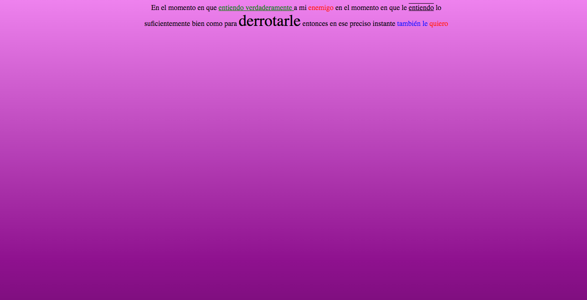

 <h1> Taller 9 - David Santiago López Orozco</h1>
    <h2>Información</h2>
    
Curso: Full Stack Básico - Grupo 1 

     
Profesor: Cristian patiño

     
<h2>Link de la página Web</h2>
<a href="https://davidlopezit1.github.io/Taller-9.Full-Stack/" target="_blank">Link Diseño Figma</a>
<h2>Punto 1 : Link de Figma</h2>
<a href="https://www.figma.com/file/i0WxaKhEFBCgVoiepPvJRB/David-L%C3%B3pez-Orozco?type=design&mode=design&t=QMUmCHIbh0AmEaRA-1" target="_blank">Link Diseño Figma</a>

<h2>punto 2 : Diseño en HTML</h2>
Link Diseño HTML 5 - del Diseño Figma</img>

<h2>punto 3 : Diseño con CSS</h2>
<a href="http://127.0.0.1:3000/punto-1-2-3/index.html" target="_blank">Link Diseño HTML con CSS</a>
Screen Google Image
</img> 
<a href="https://github.com/DavidLopezIT1/Taller-9.Full-Stack.git" target="_blank">Link del repositorio con el código Fuente (HTML y CSS)</a>
<h2>punto 4 : Títulos</h2>
Screen Google Image
</img> santyfcw@gmail.com
<a href="http://127.0.0.1:3000/punto-4/index.html" target="_blank">Punto 4 Títulos + Button Main Menu</a>

<h2>punto 5 : Párrafos</h2>
Screen Google Image Punto 5
</img> 
<a href="http://127.0.0.1:3000/punto-5/index.html" target="_blank">Punto 5 Parrafos + Button Main Menu</a>
<h2>punto 6 : Links</h2>
Screen Google Image Punto 6
</img> 
<a href="http://127.0.0.1:3000/punto-6/index.html"  target="_blank">Punto 6 Links </a>
<h2>punto 7 y 8 : Navegación</h2>

<a href="http://127.0.0.1:3000/punto-7-8/index.html" target="_blank"> Punto 7 y 8 Navegación </a>
<h2>punto 9 : Tabla</h2>

<a href="http://127.0.0.1:3000/punto-9/index.html" target="_blank"> Punto 9 Tablas </a>